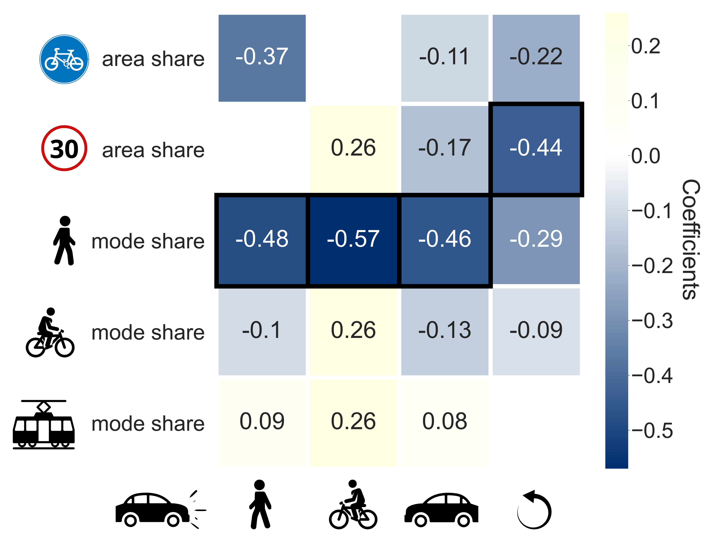

# Urban Road Safety 
> Last modified on 2021-04-14

This repository follows the paper "*Identifying urban features for vulnerable road user safety in Europe*" in which we identified urban features that are determinants of vulnerable road user safety through the analysis of inter-mode collision data across European cities. Our regression results (*shown in the heatmap below*) suggest that policies aimed at increasing the modal share of walking and cycling are keys to improve road safety for all road users.  
Here, we share the extracted/computed urban features and inter-mode collision data, as well as the regression task notebook.

*(Transportation icons designed by Freepik.)*

---
## Requirements
* Python, Jupyter
* Pandas, NumPy, Matplotlib, Seaborn
* StatsModels, Scikit-Learn
* (OSMnx - *used to generate the published data, not needed for the reproduction of the regression results*)

## [Data](https://github.com/klnmrn/urbanroadsafety/blob/main/data/urban_road_safety_data.csv)
The CSV data file contains 24 cities in Europe (rows), their respective urban features and computed inter-mode collision data for all crash participant pairs (columns).

## [Regression Notebook](https://github.com/klnmrn/urbanroadsafety/blob/main/urban-road-safety.ipynb)
The notebook performs the regression task on 6 selected crash participant pairs. 
**Before running the notebook make sure to have all the requirements installed and the data downloaded locally.**

## Authors
This project was developed by Marina Klanjčić, Laetitia Gauvin, Michele Tizzoni and Michael Szell during Marina's Lagrange applied research fellowship at [Data Science for Social Impact and Sustainability Research Group](https://isi.it/en/research/data-science-for-social-impact-and-sustainability) of [ISI Foundation](http://www.isi.it/en) in Turin, Italy. 

Data and code-related questions should be addressed to Marina Klanjčić (mrnkln@outlook.com).

## Acknowledgments 
This work was funded by a grant for the Lagrange Project by CRT Foundation.

## [MIT License](https://github.com/klnmrn/urbanroadsafety/blob/main/LICENSE)

[Back To The Top](#urban-road-safety)
